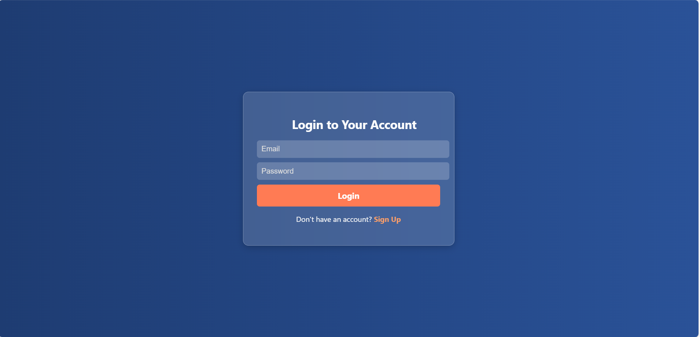
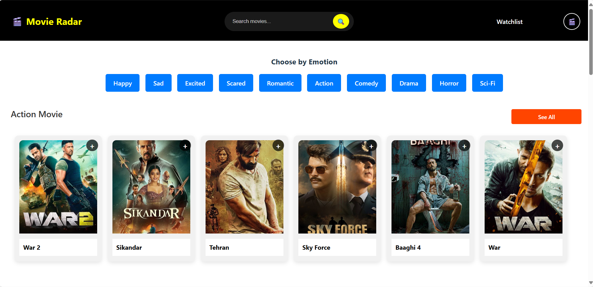
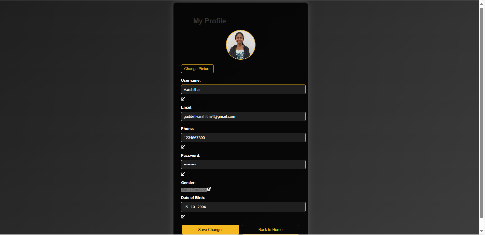
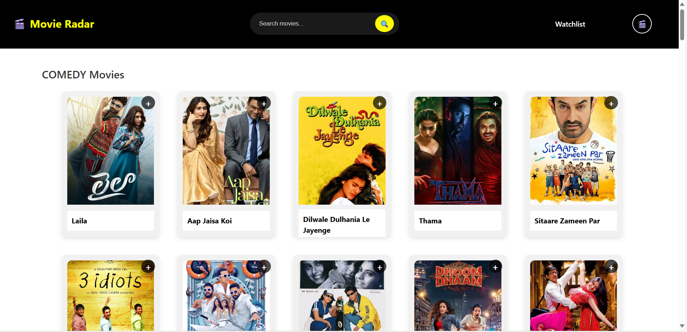
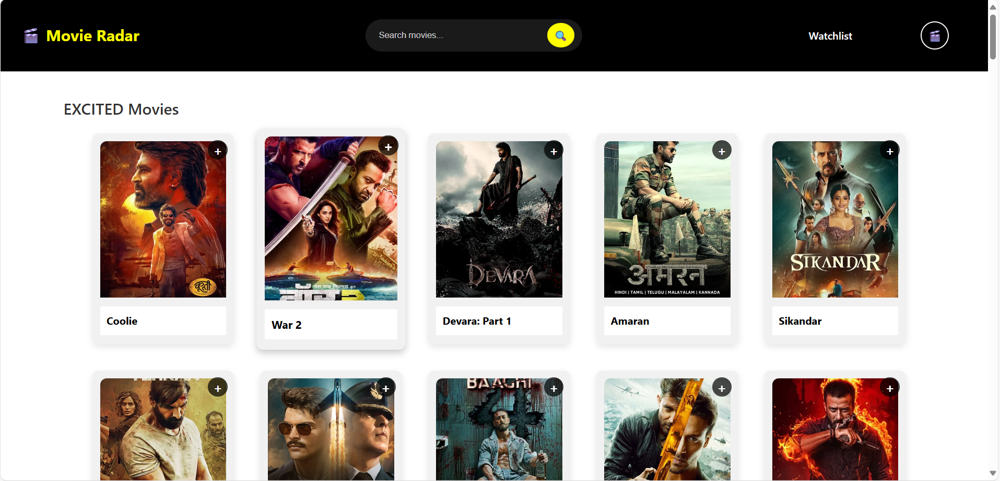
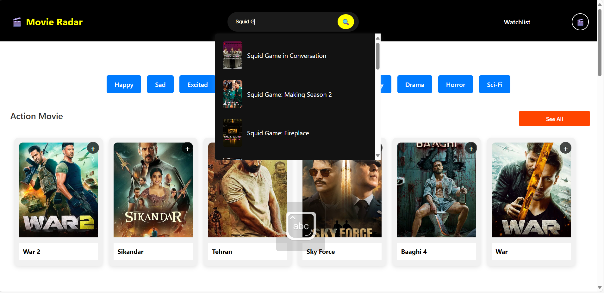
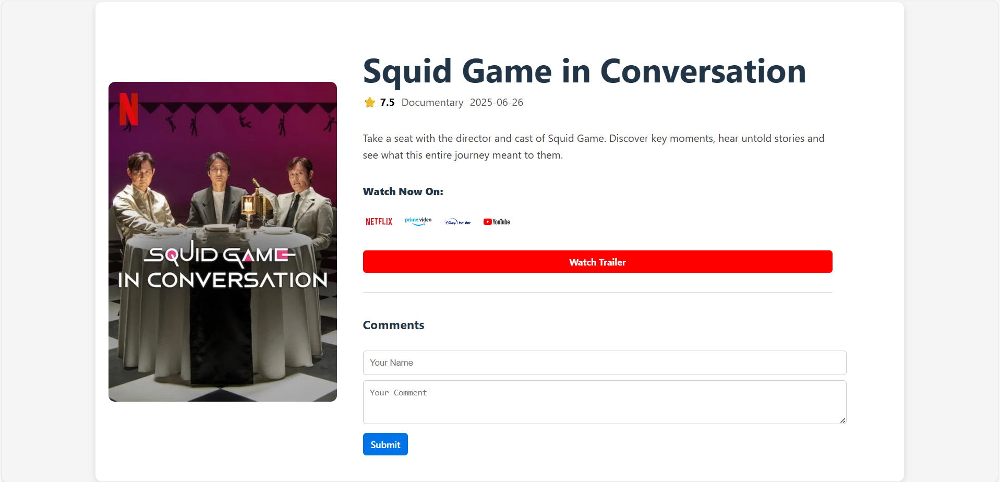
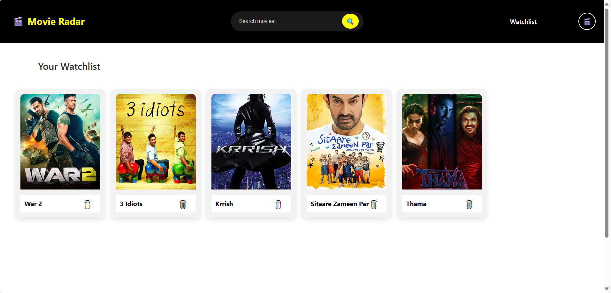

# 🎬 Movie Radar

> *Discover. Explore. Watch.*  
Movie Radar is a full-stack movie recommendation system designed to help users find the perfect movie to watch.  
With a modern UI, personalized watchlist, and real-time search, Movie Radar delivers a **seamless Netflix-style experience** — but smarter.

---

## ✨ Features

✅ **User Authentication**  
- Sign up / Log in with email, password. 

✅ **Smart Search & Browse**  
- Search movies by title.  
- Browse by genres (Action, Drama, Comedy, Sci-Fi, etc.).  
- "See All" option for genre-wise deep dive.  

✅ **Movie Details Page**  
- Description, release date, streaming platforms (YouTube, Netflix, etc.).  
- Hover over a poster to instantly preview trailers.

✅ **Personalized Watchlist**  
- Save movies for later.  
- Manage your favorites in one place.  

✅ **Clean & Modern UI**  
- Built with **React + Vite** frontend.  
- Responsive & minimal design.  
- Smooth animations.

✅ **Fast & Scalable Backend**  
- Powered by **FastAPI**.  
- Movie data from [Kaggle dataset → JSON integration].  

---

## 🛠️ Tech Stack

**Frontend:** React (Vite), Tailwind CSS, ShadCN/UI, Framer Motion  
**Backend:** FastAPI  
**Authentication:** Email/Password
**Hosting/Tools:** VS Code, GitHub  

---

### 🔹 LoginPage  
  

### 🔹 HomePage  
 
 
### 🔹 ProfilePage  
  


### 🔹 GenrePage  
  
  
  
  
  
 
### 🔹 Watchlist  
  
 


## 🚀 Getting Started

Follow these steps to set up **Movie Radar** locally.

### 1️⃣ Clone the repository
```bash
git clone https://github.com/Varshitha152004/Movie-Radar.git
cd Movie-Radar

### 2️⃣ Install dependencies
npm install

### 3️⃣ Run the frontend
npm run dev
Now open http://localhost:5173
```

###🌱 Future Improvements
-AI-powered personalized recommendations
-User reviews and ratings
-Dark mode toggle

### 🤝 Contributing

-Contributions, issues, and feature requests are welcome!

⭐ If you like this project, give it a star! ⭐
